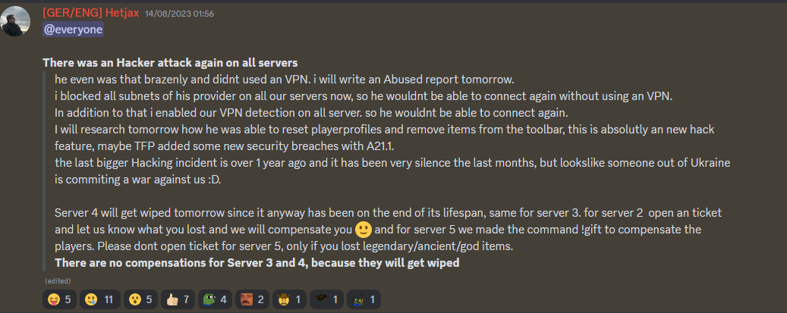
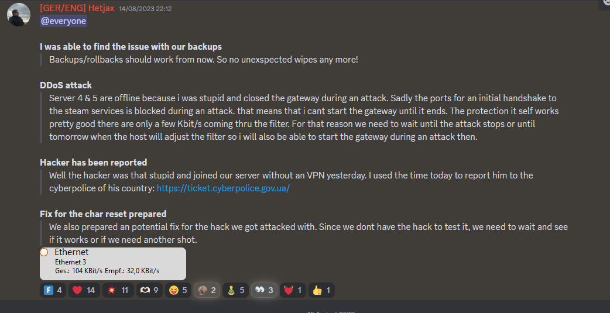
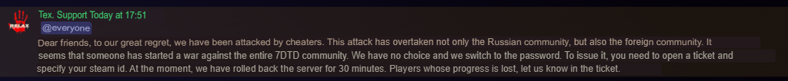
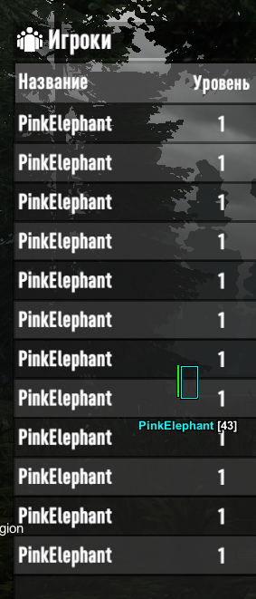

# 0-Day-To-Die
0 Day Exploit Within 7 Days To Die. This exploit allows you to wipe user saved data, Prevent players playing on a server and all around just destroy everyone's progress on a server. 
Credits to [Elijah](https://github.com/ElijahDD) for the help. 
## Images

  

  

  

  

## Explanation
This exploit works through the simple issue of all packets being managed by the entityid. We set the entityid of the player to other players and then when we send packets the server reads the entityid and asigns the data to the player. Which means what happens to one player happens to the other on the server. 
Setting entityid to each player means that if you do something like send a movement packet it will desync every player's movement, if you send a teleport packet it will teleport every user, if you die, everyone dies on the server wiping their inventories. Just setting your id to another player will reset all their stats and inventory on the server. Doing this and then utilizing a kill everyone exploit such as in my [7DTD Project](https://github.com/IntelSDM/7DTD) then you can reset everyone's data to your data.  
Additionally if you kill all players except yourself while spoofing ids then no one can respawn. everyone will be stuck eternally loading as they already exist on the server. Therefore allowing you to completely kill anyone on the server from playing and holding the server hostage.  
This simple exploit on how entityids are managed on the server allows you to destroy any server you want.
